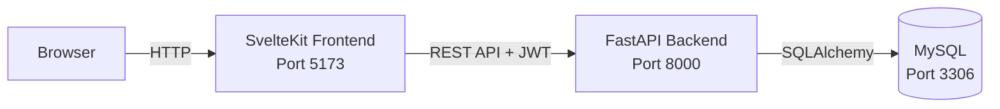

# Kochbuch – Rezeptverwaltung mit Kategorien und Einkaufsliste

Eine Webanwendung, mit der Nutzer eigene Rezepte erstellen, verwalten, teilen und bewerten können. Rezepte können in Kategorien organisiert und mit Sternebewertung versehen werden. Zutaten lassen sich auf eine persönliche Einkaufsliste setzen. Öffentliche Rezepte sind auch ohne Login einsehbar.

Projekt im Rahmen der Vorlesung **Verteilte Systeme** (4. Semester, DHBW).

## Features

- Registrierung und Login mit JWT-Authentifizierung
- Rezepte erstellen, bearbeiten und löschen
- Zutaten und Zubereitungsschritte pro Rezept
- Kategorien (z.B. Asiatisch, Italienisch, Dessert)
- Persönliche Einkaufsliste aus Zutaten
- Filter nach Kategorien
- Sternebewertung (1–5)
- Öffentliche und private Rezepte
- Auto-generierte API-Dokumentation (Swagger UI)

## Tech-Stack

| Schicht | Technologie |
|---------|-------------|
| Frontend | SvelteKit (TypeScript) |
| Backend | FastAPI (Python 3.11), SQLAlchemy |
| Authentifizierung | JWT mit Argon2 Password Hashing |
| Datenbank | MySQL 8 |
| Deployment | Docker Compose |

## Architektur

Eine ausführliche Beschreibung der Architektur und des Datenflusses findet sich in [`docs/architektur.md`](docs/architektur.md).

Kurz: Drei Container im Docker-Netzwerk:



## Datenbankschema

Eine ausführliche Beschreibung der Datenbankstruktur findet sich in [`docs/db-schema.md`](docs/db-schema.md).

## Setup

**Voraussetzungen:** Docker Desktop installiert und gestartet.

```bash
# 1. Repository klonen
git clone https://github.com/ezabell610/Verteilte-Systeme.git
cd Verteilte-Systeme

# 2. .env aus Vorlage erstellen
cp .env.example .env

# 3. SECRET_KEY für JWT generieren und in .env eintragen
openssl rand -hex 32

# 4. Alle Services bauen und starten
docker compose up --build
```

**Aufrufen:**
- Frontend: http://localhost:5173
- Backend API: http://localhost:8000
- API-Dokumentation (Swagger UI): http://localhost:8000/docs

## API-Endpoints (Übersicht)

| Methode | Pfad | Zweck | Auth |
|---------|------|-------|------|
| POST | `/auth/register` | Account anlegen | – |
| POST | `/token` | Login, gibt JWT zurück | – |
| GET | `/recipes` | Alle (öffentlichen) Rezepte | – |
| GET | `/recipes/{id}` | Einzelnes Rezept | – |
| POST | `/recipes` | Rezept erstellen | JWT |
| PUT | `/recipes/{id}` | Rezept bearbeiten | JWT |
| DELETE | `/recipes/{id}` | Rezept löschen | JWT |
| POST | `/recipes/{id}/ratings` | Rezept bewerten | JWT |
| GET | `/my-profile` | Eigenes Profil | JWT |

## Projektstruktur