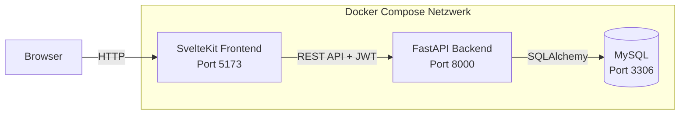

# Architektur

## Übersicht

Unsere Anwendung besteht aus drei Komponenten, die als separate Docker-Container laufen und über das interne Docker-Netzwerk miteinander kommunizieren.

## Komponenten

### Frontend – SvelteKit (Port 5173)
- Was der Nutzer im Browser sieht
- Komponentenbasiertes Framework mit eingebautem Routing
- Lädt Daten dynamisch vom Backend über die REST-API
- Speichert nach dem Login das JWT-Token

### Backend – FastAPI (Port 8000)
- REST-API in Python
- Authentifizierung über JWT-Tokens, Passwörter gehasht mit Argon2
- Automatische Eingabevalidierung über Pydantic
- Auto-generierte API-Dokumentation unter `/docs` (Swagger UI)
- Greift über SQLAlchemy ORM auf die Datenbank zu

### Datenbank – MySQL (Port 3306)
- Relationale Datenbank
- Persistenter Speicher über Docker-Volume
- Tabellen werden beim Start automatisch über SQLAlchemy angelegt

## Datenfluss am Beispiel "Rezept anzeigen"

1. Nutzer klickt im Browser auf ein Rezept
2. Frontend sendet `GET /recipes/{id}` ans Backend
3. Backend prüft (falls privat) das JWT-Token
4. Backend holt das Rezept per SQLAlchemy aus MySQL
5. Backend sendet das Rezept als JSON zurück
6. Frontend zeigt das Rezept auf der Detailseite an

## Warum Docker Compose?

Docker Compose orchestriert alle drei Services in einem Befehl (`docker compose up`). Vorteile:
- Keine manuelle Installation von Python, Node.js oder MySQL nötig
- Identische Umgebung auf allen Entwickler-Rechnern
- Inter-Container-Kommunikation über Service-Namen statt IP-Adressen
- Persistenz der DB über Docker-Volumes