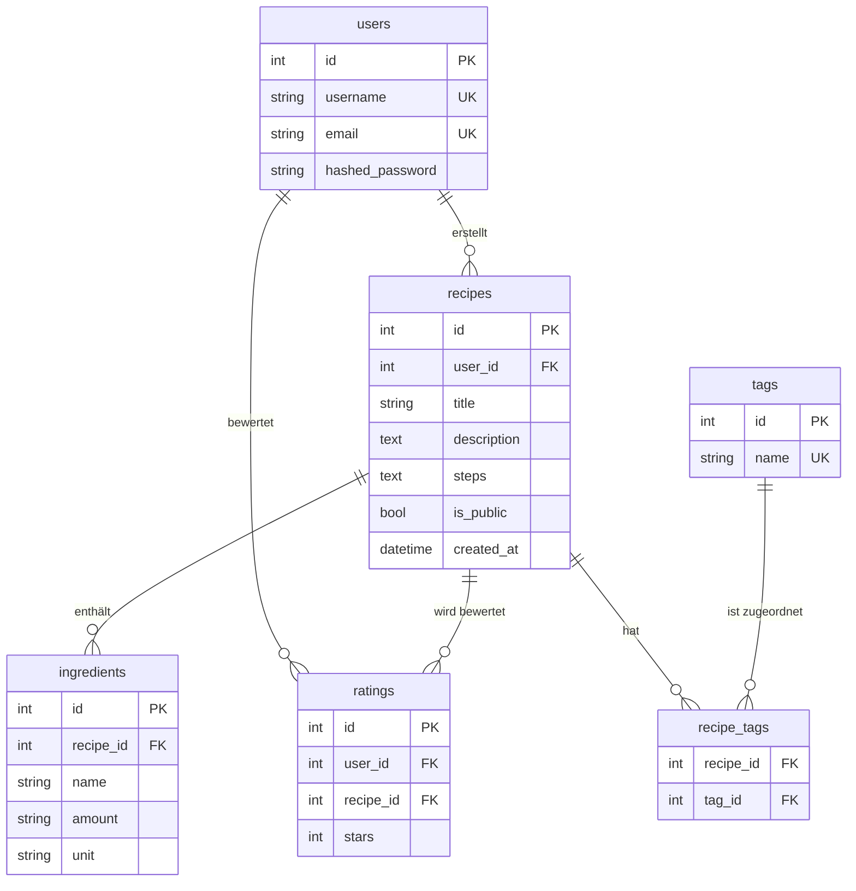

# Datenbankschema

Diese Datei beschreibt die Tabellen und Beziehungen unserer Kochbuch-App.

## Übersicht

## Erklärung der Tabellen

**users** – ist bereits im Template vorhanden. Speichert Login-Daten der registrierten Nutzer.

**tags** – Flexible Kategorisierung statt fester Kategorien. Ein Rezept kann mehrere Tags haben (z.B. "Italienisch", "Mittagessen", "Vegetarisch"). Beim Seed legen wir feste Tags an: Frühstück, Mittag, Abend, Snack, Dessert, Vegan, Vegetarisch, Italienisch, Asiatisch, Schnell, Backen.

**recipes** – Das Herzstück. Jedes Rezept gehört einem User. Die Zubereitungsschritte (steps) werden als Text gespeichert. `is_public` steuert, ob das Rezept ohne Login sichtbar ist.

**recipe_tags** – Zwischentabelle für die n:m-Beziehung zwischen Rezepten und Tags. Ohne diese Tabelle könnte ein Rezept nur einem Tag zugeordnet werden.

**ingredients** – Jede Zutat ist eine eigene Zeile mit Name, Menge und Einheit (z.B. "Mehl", "200", "g"). Gehört zu genau einem Rezept.

**ratings** – Sternebewertung (1-5) pro User und Rezept. Ein User kann jedes Rezept nur einmal bewerten (UNIQUE-Constraint auf user_id + recipe_id).

## Beziehungen

- Ein User kann viele Rezepte erstellen → 1:n
- Ein Rezept kann viele Zutaten haben → 1:n
- Ein Rezept kann viele Tags haben, ein Tag kann zu vielen Rezepten gehören → n:m über recipe_tags
- Ein User kann viele Bewertungen abgeben → 1:n
- Ein Rezept kann viele Bewertungen erhalten → 1:n