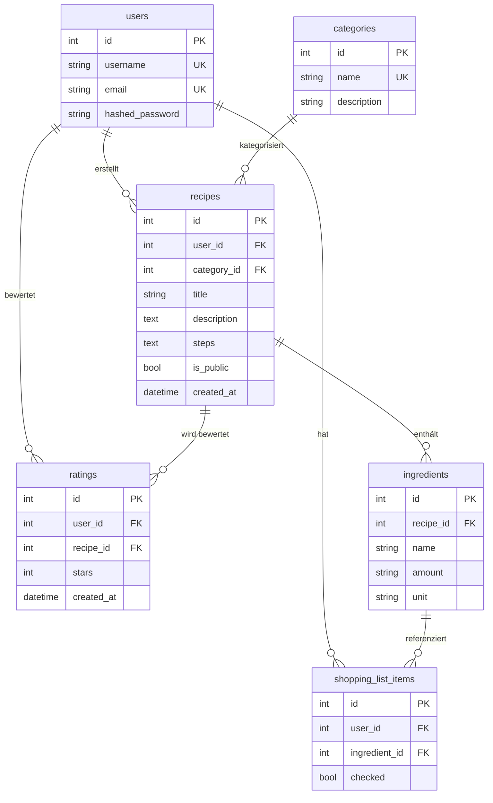

# Datenbankschema

Diese Datei beschreibt die Tabellen und Beziehungen unserer Kochbuch-App.
Die Tabellen werden beim Start automatisch über SQLAlchemy angelegt (`Base.metadata.create_all`).

## Übersicht

## Erklärung der Tabellen

**users** – Speichert die registrierten Nutzer mit Benutzername, E-Mail und gehashtem Passwort. Das Passwort wird mit Argon2 gehasht und nie im Klartext gespeichert.

**categories** – Feste Kategorien wie z.B. Vegan, Italienisch, Dessert, Asiatisch, Schnelle Küche. Werden über das Seed-Script angelegt; Nutzer können keine neuen Kategorien erstellen.

**recipes** – Das Herzstück. Jedes Rezept gehört zu genau einem User und einer Kategorie. `is_public` steuert, ob das Rezept ohne Login sichtbar ist (default: false – Rezepte sind standardmäßig privat). Die Zubereitungsschritte (`steps`) werden als Text gespeichert.

**ingredients** – Jede Zutat ist eine eigene Zeile mit Name, Menge und Einheit (z.B. "Mehl", "200", "g"). Gehört zu genau einem Rezept. Wird beim Löschen des Rezepts automatisch mitgelöscht (`cascade="all, delete-orphan"`).

**ratings** – Sternebewertung (1-5) pro User und Rezept. Wird beim Löschen des Rezepts automatisch mitgelöscht.

**shopping_list_items** – Einkaufsliste pro User. Verknüpft User und Zutat. Das `checked`-Feld speichert, ob die Zutat beim Einkaufen schon abgehakt wurde.

## Beziehungen

- Ein User kann viele Rezepte erstellen → 1:n
- Ein User kann viele Bewertungen abgeben → 1:n
- Ein User kann viele Einkaufslisten-Einträge haben → 1:n
- Eine Kategorie kann viele Rezepte enthalten → 1:n
- Ein Rezept kann viele Zutaten haben → 1:n
- Ein Rezept kann viele Bewertungen erhalten → 1:n
- Eine Zutat kann in mehreren Einkaufslisten-Einträgen referenziert sein → 1:n

## Besonderheiten

- **Cascade Delete:** Wird ein Rezept gelöscht, werden alle zugehörigen Zutaten und Bewertungen automatisch mitgelöscht.
- **Unique Constraints:** `username` und `email` müssen unique sein; `category.name` ebenfalls.
- **Default-Werte:** Rezepte sind standardmäßig privat (`is_public = false`); Einkaufslisten-Einträge sind initial nicht abgehakt (`checked = false`).
- **ORM:** Definition als SQLAlchemy-Models in `backend/models.py`.